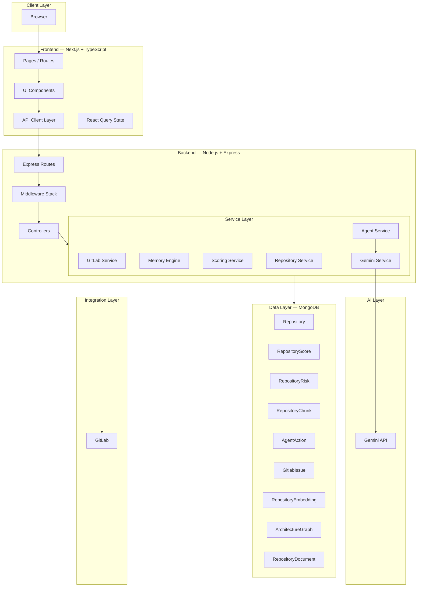

# CodebaseOS Architecture

## System Overview

CodebaseOS follows a layered architecture pattern with a clear separation of concerns: Frontend (Next.js) → Backend API (Express) → AI Layer (Gemini) → Data Layer (MongoDB) → Integration Layer (GitLab MCP).

---

## Architecture Diagram



---

## Layer Details

### 1. Frontend Layer (Next.js)

```
frontend/src/
├── app/          # Next.js App Router pages
├── api/          # Backend API client (typed fetch wrappers)
├── components/   # React components (layout, shared, features)
├── hooks/        # Custom React hooks
├── lib/          # Utilities (query client, helpers)
├── services/     # Frontend service abstractions
└── types/        # TypeScript interfaces and types
```

The frontend communicates with the backend exclusively through the REST API. It never accesses Gemini or GitLab directly.

### 2. Backend Layer (Express)

```
backend/src/
├── config/       # Environment, database configuration
├── controllers/  # Request handlers
├── middleware/   # Error handling, validation
├── models/       # Mongoose schemas and models
├── routes/       # Express route definitions
├── services/     # Business logic
└── utils/        # Logger, helpers
```

### 3. Service Layer

Each service has a single responsibility:

| Service | Responsibility |
|---------|---------------|
| **Repository Service** | Upload, clone, analyze repositories |
| **Memory Engine** | Chunk, summarize, embed, store repository context |
| **Scoring Service** | Calculate Knowledge Debt, Survivability, Recoverability, Bus Factor |
| **Agent Service** | Orchestrate the full agent workflow pipeline |
| **GitLab Service** | Create issues in GitLab, store locally as fallback |
| **Gemini Service** | AI reasoning and recommendation generation |

### 4. Data Layer (MongoDB Collections)

| Collection | Purpose |
|------------|---------|
| `repositories` | Repository metadata and analysis results |
| `repositoryscores` | Knowledge Debt, Survivability, Recoverability scores |
| `repositoryrisks` | Detected risks with severity and recommendations |
| `repositorychunks` | Knowledge chunks from memory engine |
| `repositoryembeddings` | Vector embeddings for semantic search |
| `agentactions` | Agent action audit trail |
| `gitlabissues` | GitLab issues (mirrored locally) |
| `architecturegraphs` | Architecture graph nodes and edges |
| `repositorydocuments` | Generated documentation |

### 5. AI Layer (Gemini)

Gemini is used for:
- **Agent reasoning** — analyzing repository risks and generating explanations
- **Recommendation generation** — creating actionable recommendations based on scores
- **Future:** Documentation generation, learning mission creation

### 6. Integration Layer (GitLab MCP)

GitLab MCP enables:
- Issue creation from detected risks
- Documentation task creation
- Learning mission creation
- Ownership risk issue creation

When GitLab is unavailable, all operations fall back to local MongoDB storage.

---

## Request Flow

```
1. Client makes HTTP request to /api/v1/*
2. Express routes match the endpoint
3. Middleware processes request (CORS, JSON parsing)
4. Controller extracts parameters and calls service
5. Service executes business logic (DB queries, AI calls, GitLab API)
6. Response flows back through controller → middleware → client
```

### Example: Agent Run

```
POST /api/v1/agent/:repositoryId/run

1. Agent Service receives the request
2. Scoring Service calculates Knowledge Debt, Survivability, Recoverability
3. Repository Risk fetches open risks
4. Agent Service generates reasoning using Gemini
5. Agent Service generates recommendations
6. GitLab Service creates issues based on risk triggers
7. Agent Action stores all actions for audit trail
8. Response returned with complete timeline
```

---

## API Design

Base URL: `/api/v1`

### Repository Endpoints

| Method | Path | Description |
|--------|------|-------------|
| POST | `/repositories/analyze` | Analyze a repository by URL |
| POST | `/repositories/upload` | Upload a ZIP file |
| GET | `/repositories` | List all repositories |
| GET | `/repositories/:id` | Get repository details |
| DELETE | `/repositories/:id` | Delete a repository |

### Memory Endpoints

| Method | Path | Description |
|--------|------|-------------|
| GET | `/memory/:repositoryId` | Get repository memory |
| GET | `/memory/:repositoryId/chunks` | Get knowledge chunks |
| GET | `/memory/chunks/:chunkId` | Get chunk details |
| POST | `/memory/:repositoryId/rebuild` | Rebuild memory |

### Score Endpoints

| Method | Path | Description |
|--------|------|-------------|
| GET | `/scores/:repositoryId/knowledge-debt` | Get Knowledge Debt score |
| GET | `/scores/:repositoryId/survivability` | Get Survivability score |
| GET | `/scores/:repositoryId/recoverability` | Get Recoverability score |
| GET | `/scores/:repositoryId/bus-factor` | Get Bus Factor |

### Agent Endpoints

| Method | Path | Description |
|--------|------|-------------|
| POST | `/agent/:repositoryId/run` | Execute full agent workflow |
| GET | `/agent/:repositoryId/status` | Get agent status |
| GET | `/agent/:repositoryId/timeline` | Get action timeline |
| GET | `/agent/:repositoryId/feed` | Get enriched agent feed |
| GET | `/agent/:repositoryId/actions` | Get full action history |
| GET | `/agent/:repositoryId/recommendations` | Get recommendations |

### GitLab Endpoints

| Method | Path | Description |
|--------|------|-------------|
| POST | `/gitlab/issues` | Create a generic issue |
| POST | `/gitlab/documentation-issue` | Create documentation issue |
| POST | `/gitlab/learning-mission` | Create learning mission |
| POST | `/gitlab/ownership-risk` | Create ownership risk issue |
| POST | `/gitlab/survivability-issue` | Create survivability issue |
| POST | `/gitlab/recoverability-issue` | Create recoverability issue |
| GET | `/gitlab/activity/:repositoryId` | Get GitLab activity |

---

## Error Handling

All errors follow a consistent format:

```json
{
  "success": false,
  "error": {
    "code": "ERROR_CODE",
    "message": "Human-readable description"
  }
}
```

Error codes are defined in `AppError` class and propagated through Express error middleware.

---

## Configuration

Environment variables are loaded from `backend/.env`:

```env
PORT=5000
MONGO_URI=mongodb://localhost:27017/codebaseos
GEMINI_API_KEY=your_key
GITLAB_TOKEN=your_token
GITLAB_PROJECT_ID=your_project_id
```

See [SETUP.md](SETUP.md) for complete configuration details.

---

## Security

- Frontend never directly accesses Gemini or GitLab
- All API responses use consistent `{ success, data/message }` format
- Error messages are sanitized in production
- GitLab tokens are stored server-side only
- CORS is configured for the frontend origin