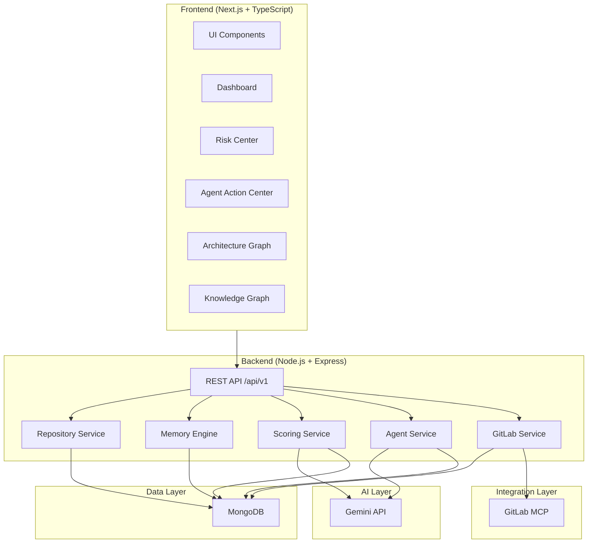

# CodebaseOS

**AI Engineering Knowledge Agent**

> AI generates software faster than humans can understand it.  
> CodebaseOS transforms repositories into knowledge and action.

[](LICENSE)
[](https://gitlab.com)
[](https://cloud.google.com)
[](https://ai.google.dev)

---

## 📖 Table of Contents

- [The AI Knowledge Crisis](#-the-ai-knowledge-crisis)
- [Solution](#-solution)
- [Features](#-features)
- [Demo Workflow](#-demo-workflow)
- [Why It Matters](#-why-it-matters)
- [Screenshots](#-screenshots)
- [Tech Stack](#-tech-stack)
- [Architecture](#-architecture)
- [Repository Memory Engine™](#-repository-memory-engine)
- [Recoverability Score™](#-recoverability-score)
- [GitLab Agent Actions™](#-gitlab-agent-actions)
- [Installation](#-installation)
- [Roadmap](#-roadmap)
- [Contributing](#-contributing)
- [License](#-license)

---

## 🔴 The AI Knowledge Crisis

Modern AI tools generate software faster than humans can understand it.

**Tools like Gemini, Cursor, Claude, Copilot, Lovable, Replit AI, and Bolt** allow developers to create entire applications in hours. But this speed creates a new problem.

Teams increasingly inherit repositories that nobody fully understands:

| Inherited Asset | Without Understanding |
|----------------|----------------------|
| AI-generated projects | Architecture |
| Startup MVPs | Dependencies |
| Open source repositories | Authentication |
| Legacy systems | Business Logic |
| Abandoned projects | Deployment |
| Freelancer handoffs | Ownership |

### Software Knowledge Debt

This creates a new category of technical debt:

**Software Knowledge Debt** — when a repository functions technically but cannot be understood, maintained, transferred, or safely evolved by anyone other than its original creator.

Common symptoms:

- ❌ Missing documentation
- ❌ Knowledge concentrated in one developer
- ❌ Unknown architecture
- ❌ Duplicate logic
- ❌ AI-generated code without explanations
- ❌ Difficult onboarding
- ❌ High maintenance risk

**CodebaseOS solves this.**

---

## ✅ Solution

CodebaseOS acts as an **AI Engineering Knowledge Agent**.

Instead of simply explaining code, CodebaseOS:

1. **Builds persistent repository memory** — chunks, summarizes, and stores repository understanding
2. **Measures knowledge risk** — Knowledge Debt, Survivability, Recoverability, Bus Factor
3. **Identifies ownership concentration** — maps who knows what
4. **Evaluates recoverability** — tells you if a repository can be saved or needs rebuilding
5. **Creates actionable workflows** — generates real GitLab issues from detected risks

The result: repositories become transferable organizational knowledge instead of black-box code dumps.

---

## 🚀 Features

| Feature | Description |
|---------|-------------|
| **Repository Intelligence Engine** | Detects framework, language, database, auth, services, APIs |
| **Repository Memory Engine™** | Persistent repository understanding — chunks, embeddings, context |
| **Knowledge Debt Score™** | Measures how difficult a repository is to understand and maintain (0–100) |
| **Survivability Score™** | Measures whether a repository can survive without its original creator (0–100) |
| **Recoverability Score™** | Tells freelancers and teams whether software should be continued, refactored, or rebuilt |
| **Repository Risk Center™** | Centralized dashboard for all repository risks |
| **Bus Factor Analysis™** | Detects knowledge concentration in single contributors |
| **Knowledge Ownership Map™** | Visualizes ownership distribution across modules |
| **Architecture Graph™** | Interactive visualization of repository architecture |
| **Knowledge Graph™** | Maps repository concepts and their relationships |
| **Freelancer Rescue Mode™** | Rapid onboarding for unknown repositories |
| **GitLab Agent Actions™** | Creates real GitLab issues from detected risks |
| **Knowledge Interview™** | Tests and measures repository understanding |
| **Learning Missions™** | Generates repository-specific learning tasks |
| **Documentation Generator™** | Auto-generates architecture docs, README, onboarding guides |

---

## 🔄 Demo Workflow

```
Repository Upload
     ↓
Repository Analysis — detects framework, language, dependencies, services
     ↓
Repository Memory Engine — chunks, summarizes, embeds, stores
     ↓
Knowledge Debt Analysis — measures documentation and understanding gaps
     ↓
Survivability Analysis — measures bus factor and ownership risk
     ↓
Recoverability Analysis — determines if repository can be recovered
     ↓
Agent Recommendations — AI-powered reasoning and action plan
     ↓
GitLab Issue Creation — real issues created in GitLab automatically
```

Each step is tracked in the **Agent Timeline** and persisted in the **Agent Action Audit Trail**.

---

## 💡 Why It Matters

> AI can generate software.  
> **Understanding software is now the bottleneck.**  
> CodebaseOS solves that bottleneck.

### Before CodebaseOS

A freelancer receives an unknown repository. The original developer is gone. Documentation is missing. AI generated half the code. The client asks: *"Can you continue development?"*

The problem is not writing code. The problem is understanding whether the repository can be trusted.

### After CodebaseOS

1. Upload the repository.
2. CodebaseOS analyzes it in minutes.
3. You get a complete intelligence report: architecture, dependencies, ownership, risks.
4. The Recoverability Score™ tells you: maintain, refactor, or rebuild.
5. GitLab issues are created automatically to fix detected problems.

**Days of investigation → Minutes of clarity.**

---

## 📸 Screenshots

> *Coming soon — placeholders for the demo.*

| Page | Description |
|------|-------------|
| **Homepage** | Landing page with hero, problem statement, and CTA |
| **Dashboard** | Repository overview with key metrics |
| **Repository Analysis** | Framework, language, dependencies, services detected |
| **Memory Engine** | Files indexed, chunks created, context coverage |
| **Risk Center** | Knowledge Debt, Survivability, Recoverability, Bus Factor |
| **Agent Action Center** | Agent timeline, reasoning, recommendations, actions |
| **GitLab Actions** | Issues created in GitLab from detected risks |

---

## 🛠 Tech Stack

### Frontend

| Technology | Purpose |
|------------|---------|
| [Next.js](https://nextjs.org) | React framework |
| [TypeScript](https://typescriptlang.org) | Type safety |
| [Tailwind CSS](https://tailwindcss.com) | Utility-first styling |
| [React Flow](https://reactflow.dev) | Architecture graph visualization |
| [Recharts](https://recharts.org) | Charts and metrics |
| [Framer Motion](https://framer.com/motion) | Animations |
| [shadcn/ui](https://ui.shadcn.com) | Component library |

### Backend

| Technology | Purpose |
|------------|---------|
| [Node.js](https://nodejs.org) | Runtime |
| [Express](https://expressjs.com) | API framework |
| [TypeScript](https://typescriptlang.org) | Type safety |

### Database

| Technology | Purpose |
|------------|---------|
| [MongoDB](https://mongodb.com) | Primary database |

### AI

| Technology | Purpose |
|------------|---------|
| [Gemini API](https://ai.google.dev) | AI reasoning and recommendations |

### Cloud

| Technology | Purpose |
|------------|---------|
| [Google Cloud](https://cloud.google.com) | Hosting and AI services |

### Integrations

| Technology | Purpose |
|------------|---------|
| [GitLab MCP](https://gitlab.com) | Issue creation and engineering workflows |

---

## 🏗 Architecture



### Request Flow

```
Client → Frontend → REST API → Service → Database / Gemini / GitLab
                                                         ↓
                                              Response → Client
```

---

## 🧠 Repository Memory Engine

### The Context Loss Problem

Traditional AI tools lose repository context when repositories become large. Developers repeatedly upload files and folders, and the AI only sees fragments. This creates hallucinations, incorrect recommendations, and incomplete understanding.

### How the Memory Engine Works

```
1. Parse Repository → parse all files, folders, structure
2. Chunk Files → split code into meaningful chunks
3. AST Analysis → extract functions, classes, imports
4. Summarize Modules → generate module-level summaries
5. Map Dependencies → detect import graphs and service dependencies
6. Generate Embeddings → create vector embeddings for semantic search
7. Create Knowledge Graph → build concept-relationship maps
8. Store Repository Memory → persist in MongoDB for persistent access
```

### Dashboard Metrics

| Metric | What It Measures |
|--------|-----------------|
| Files Indexed | Total files analyzed |
| APIs Indexed | API endpoints detected |
| Services Indexed | Backend services identified |
| Knowledge Chunks | Semantic chunks created |
| Context Coverage | Percentage of repository mapped |

---

## 📊 Recoverability Score

### The Freelancer Problem

A freelancer receives an unknown repository. The original developer is gone. Documentation is missing. AI generated half the code.

The biggest question: **Can this repository be recovered?**

CodebaseOS answers with the **Recoverability Score™** — a 0–100 metric that tells you whether software should be:

| Score | Verdict | Action |
|-------|---------|--------|
| 80–100 | ✅ **Healthy** | Maintain normally |
| 60–79 | 🔶 **Recoverable** | Minor refactoring needed |
| 40–59 | 🟠 **High Refactoring Cost** | Significant work required |
| 0–39 | 🔴 **Rebuild Recommended** | Start over with proper practices |

### Calculation Inputs

- Knowledge Debt (30% weight)
- Survivability Risk (25% weight)
- Architecture Complexity (15% weight)
- Dependency Health (10% weight)
- Dead Code (10% weight)
- Duplicate Logic (5% weight)
- Documentation Coverage (5% weight)

---

## ⚡ GitLab Agent Actions

### From Insight to Action

Most repository tools stop at analysis. CodebaseOS goes further.

```
Knowledge Gap Detected
     ↓
Agent Reasoning — "This module has 92% single-owner concentration"
     ↓
Agent Recommendation — "Assign backup owner, create documentation"
     ↓
GitLab Issue Created — Real issue appears in your GitLab project
     ↓
Engineering Workflow — Team picks up the work
```

### Trigger Matrix

| Condition | Action |
|-----------|--------|
| Knowledge Debt > 80 | Generate Documentation Issue + Learning Missions |
| Survivability < 40 | Create Knowledge Transfer Issue + Documentation |
| Recoverability < 40 | Generate Recovery Plan + Refactoring Tasks |
| Bus Factor = 1 | Create Ownership Issue + Learning Mission |

### GitLab Labels Used

`documentation`, `agent-generated`, `high-priority`, `ownership`, `survivability`, `recoverability`, `learning`

---

## 🔧 Installation

### Prerequisites

- Node.js 18+
- MongoDB (local or Atlas)
- GitLab account (optional, falls back to local storage)
- Google Gemini API key

### Frontend Setup

```bash
cd frontend
npm install
npm run dev
```

Frontend runs on `http://localhost:3000`.

### Backend Setup

```bash
cd backend
npm install
npm run dev
```

Backend runs on `http://localhost:5000`.

### Environment Variables

Create `.env` in the `backend` directory:

```env
# Server
PORT=5000
NODE_ENV=development

# MongoDB
MONGO_URI=mongodb://localhost:27017/codebaseos

# Gemini
GEMINI_API_KEY=your_gemini_api_key

# GitLab (optional — falls back to local storage)
GITLAB_TOKEN=your_gitlab_token
GITLAB_PROJECT_ID=your_gitlab_project_id
GITLAB_BASE_URL=https://gitlab.com/api/v4
```

### MongoDB Setup

**Option 1: Local MongoDB**

```bash
mongod --dbpath /data/db
```

**Option 2: MongoDB Atlas**

Create a free cluster at [mongodb.com/atlas](https://mongodb.com/atlas) and use the connection string as `MONGO_URI`.

### Gemini Setup

Get an API key from [Google AI Studio](https://aistudio.google.com/apikey).

### GitLab Setup (Optional)

1. Generate a GitLab personal access token with `api` scope.
2. Get your project ID from GitLab (Settings → General → Project ID).
3. Add both to `.env`.

If GitLab is not configured, all issues are stored locally in MongoDB and still accessible via the API.

---

## 🗺 Roadmap

| Status | Feature |
|--------|---------|
| ✅ | Repository Upload & Analysis |
| ✅ | Repository Memory Engine™ |
| ✅ | Knowledge Debt Score™ |
| ✅ | Survivability Score™ |
| ✅ | Recoverability Score™ |
| ✅ | Bus Factor Analysis™ |
| ✅ | Architecture Graph™ |
| ✅ | Knowledge Graph™ |
| ✅ | Freelancer Rescue Mode™ |
| ✅ | GitLab Agent Actions™ |
| ✅ | Agent Action Center™ |
| 🔄 | Documentation Generator™ |
| 🔄 | Learning Missions™ |
| 🔄 | Knowledge Interview™ |
| 📅 | Merge Request Creation |
| 📅 | Epic & Sprint Planning |
| 📅 | Team Analytics Dashboard |

---

## 🤝 Contributing

We welcome contributions! See [CONTRIBUTING.md](CONTRIBUTING.md) for guidelines.

**Quick start:**

1. Fork the repository.
2. Create a feature branch.
3. Make your changes.
4. Submit a pull request.

---

## 📄 License

CodebaseOS is open source under the [MIT License](LICENSE).

---

## 🙏 Acknowledgments

- [Google Gemini](https://ai.google.dev) for AI capabilities
- [GitLab](https://gitlab.com) for engineering workflow integration
- Open source community for the tools that make this possible

---

<div align="center">
  <p><strong>CodebaseOS</strong> — AI Engineering Knowledge Agent</p>
  <p>
    <a href="https://github.com/muhammad-harisk23/CodebaseOS">GitHub</a> ·
    <a href="SETUP.md">Setup Guide</a> ·
    <a href="DEMO.md">Demo Guide</a> ·
    <a href="JUDGES.md">For Judges</a>
  </p>
  <p>
    <em>AI generates software faster than humans can understand it.</em><br>
    <em>CodebaseOS transforms repositories into knowledge and action.</em>
  </p>
</div>